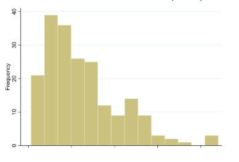
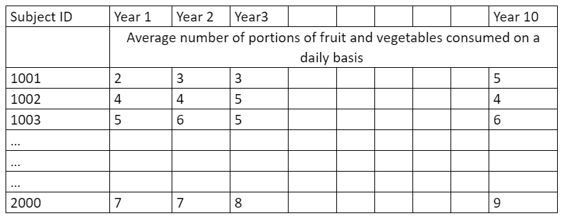
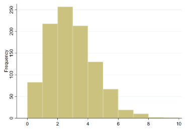

```{r setup, include=FALSE}
knitr::opts_chunk$set(echo = TRUE)
```

### Formas de tratar los datos extranos

> Pregunta 1: El vídeo introdujo la idea de que los datos no siempre se ajustan a distribuciones bien comportadas. Sin embargo, esto importa en mayor o menor medida dependiendo de cómo piense utilizar los datos. A continuación pondrá a prueba su comprensión de esto y de las posibles soluciones de que dispone cuando tiene datos "raros". 

> Dev ha recopilado información sobre el número medio de veces al mes que la gente visitó una determinada página web de información sobre salud pública (no tiene información sobre las personas que no accedieron a la página en absoluto). Traza los datos y observa lo siguiente:



Dev quiere describir el acceso al sitio web en su muestra. ¿Cuál sería el mejor enfoque para él para hacerlo?   

- [ ] Intente transformar los datos para ver si hace que la distribución sea más normal y analícelos como una distribución normal.   
- [ ] Dicotomice los datos en uso alto y bajo utilizando un punto de corte como 5 o más veces al mes de media y analícelos como una distribución binomial. 
- [x] Presente una sencilla tabla resumen de frecuencias y proporción de personas por número medio de inicios de sesión. 

Correcto. Dev no pretende utilizar los datos de su muestra para hacer inferencias sobre una población más amplia, por lo que no es necesario hacer ningún supuesto de distribución: basta con una simple estadística descriptiva. Podría elaborar una tabla como la que se muestra a continuación:   

| Número medio de inicios de sesión | Número de personas |
|-----------------------------------|--------------------|
| 1                                 | 21                 |
| 2                                 | 36                 |
| 3                                 | 39                 |

En este ejercicio he tenido dificultades a la hora de entender el gráfico. Este histograma muestra la frecuencia de visitas a una página web. El eje Y es el número de personas que visitan la página web y el eje X es el número de visitas. Mi confusión proviene a que intento encajar el tiempo, número medio al mes, con el número de visitas. Para ese caso, estaríamos buscando el número de visitas a lo largo del tiempo, y no el número de personas que visitan la página web. Para entenderlo mejor podemos realizar un ejemplo con R.

```{r}
library(ggplot2)

set.seed(123)
visitas <- rpois(30, lambda = 5)

# histograma
ggplot(data.frame(visitas), aes(x = visitas)) +
  geom_histogram(binwidth = 1, fill = "lightblue", color = "black") +
  labs(title = "Número de visitas a la página web",
       x = "Número de visitas",
       y = "Número de personas")

```

> Pregunta 2: Ji-woo está llevando a cabo un estudio en el que se analizan los efectos de un nuevo fármaco sobre la visión en comparación con un grupo que recibe la atención estándar. El resultado sobre la visión se mide con el ETDRS (una escala de agudeza visual), que tiene un rango de 0-100 (pérdida completa de visión a visión perfecta). Recoge la ETDRS en la línea de base antes de que se administre el fármaco/cuidado estándar y 6 meses después. En la línea de base, la muestra contiene pacientes con una visión muy deficiente, incluidos algunos con pérdida completa de visión. La bibliografía muestra que es probable que las puntuaciones basales estén sesgadas positivamente. Ji-woo quiere comparar las puntuaciones de cambio en el ETDRS entre la línea de base y los 6 meses en los dos grupos de tratamiento. ¿Cómo debe proceder Ji-woo? 

 Al pensar en su respuesta, una de las cosas que debe tener en cuenta es la forma en que el médico podría comunicar más fácilmente la información al paciente.
 
 
- [ ] Presente las puntuaciones medias de cambio por grupo.   
- [x] Dicotomice las puntuaciones de cambio para que los datos sigan una distribución binomial.  


Correcto. Dicotomizar los datos en un punto que represente una mejora clínicamente significativa para los pacientes es la mejor opción presentada aquí. Es fácil de entender para los pacientes y de comunicar para los clínicos. Con unos datos tan sesgados, es probable que las puntuaciones medias de cambio sean pequeñas y podrían enmascarar diferencias clínicas potencialmente importantes.

Analicemos ambas opciones en detalle:

- Presentar las puntuaciones medias de cambio por grupo: este enfoque implica calcular la diferencia entre las puntuaciones de la línea de base y las de seguimiento para cada paciente y luego comparar las medias de estas diferencias entre los dos grupos de tratamiento. Sin embargo, con una distribución sesgada, las puntuaciones medias de cambio podrían no reflejar la mejora clínica real. Además, este enfoque no es fácil de entender para los pacientes y de comunicar para los clínicos.

- Dicotomizar las puntuaciones de cambio para que los datos sigan una distribución binomial: este enfoque implica definir un punto de corte que represente una mejora clínicamente significativa para los pacientes y luego clasificar a los pacientes en dos categorías (mejora/no mejora) en función de si su puntuación de cambio supera o no el punto de corte. Este enfoque es fácil de entender para los pacientes y de comunicar para los clínicos. Además, con unos datos tan sesgados, es probable que las puntuaciones medias de cambio sean pequeñas y podrían enmascarar diferencias clínicas potencialmente importantes.

> Pregunta 3: Nisha dispone de datos que contienen el consumo medio diario de fruta y verdura de cada persona a lo largo de un año durante los últimos diez años. En la tabla siguiente figura un extracto.



A continuación se muestra un histograma de los datos correspondientes al año 1: 



> Quiere dibujar un gráfico de la tendencia a lo largo de este periodo de 10 años. Ella decide que necesita obtener una medida resumen para cada año para comparar a lo largo del tiempo. ¿Cuál es la mejor manera de resumir los datos por año para hacer una comparación a lo largo del tiempo? 

- [ ] Calcule el consumo medio diario de fruta y verdura de cada año. 
- [x] Calcule la proporción anual que come por encima de la cantidad diaria recomendada. 

Para comparar la tendencia del consumo medio diario de frutas y verduras a lo largo de un período de 10 años, Nisha necesita una medida resumen que capture adecuadamente la tendencia central de los datos de cada año. Hay varias medidas que ella podría considerar:

* **Media**: Es la suma de todos los valores dividida por el número de observaciones. La media es útil cuando se desea entender el consumo promedio de frutas y verduras, pero puede ser sensible a los valores atípicos.

* **Mediana**: Es el valor central de un conjunto de números ordenados. La mediana es menos sensible a los valores atípicos y podría ser una mejor medida si la distribución de los datos es muy sesgada.

* **Moda**: Es el valor más frecuente en el conjunto de datos. No es comúnmente usada para datos continuos, pero podría ser útil si hay un número específico de porciones que es consumido notablemente más a menudo que otros.

Dado el histograma del año 1 que muestra una distribución con una cola a la derecha (sesgada hacia valores más altos), la media podría estar influenciada por consumos muy altos poco frecuentes, mientras que la mediana daría una mejor idea de la cantidad de consumo "típico" diario.


