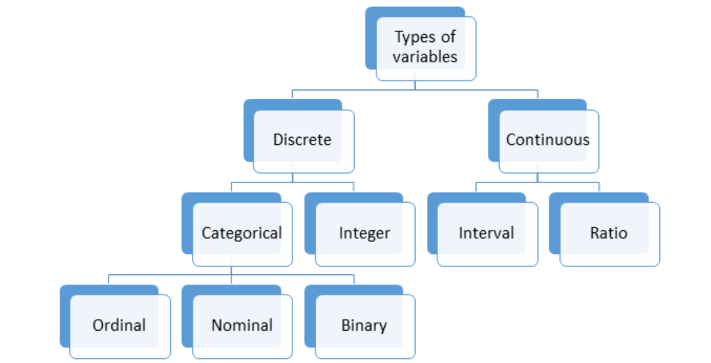
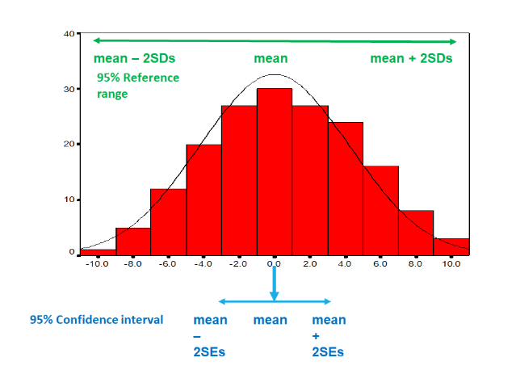

```{r setup, include=FALSE}
knitr::opts_chunk$set(echo = TRUE)
```

# Apuntes de Estadística: Fundamentos para la Investigación en Salud Pública

En la introducción a nuestro curso sobre estadísticas aplicadas a la salud pública, abordamos la importancia crítica del pensamiento estadístico en la investigación. A través de un ejemplo histórico sobre la epidemia de cólera en la Inglaterra del siglo XIX, destacamos cómo errores en el análisis e interpretación de datos pueden tener consecuencias fatales. Este caso subraya la necesidad de un enfoque metódico y basado en principios estadísticos para superar los retos en la investigación científica.

## Tipos de Variables

Las variables son fundamentales en cualquier ciencia porque describen características que pueden variar entre personas o entornos. Diferenciamos principalmente entre variables y constantes; las primeras cambian, mientras que las segundas, como la velocidad de la luz, permanecen inalteradas. En la salud pública, las variables pueden ser características personales, hábitos de vida, o factores ambientales que influencian los resultados de salud. Por ejemplo, la ingesta de frutas y verduras puede ser una variable relevante cuando estudiamos su relación con enfermedades como el cáncer.

## Distribuciones de Frecuencias

La distribución de frecuencias es una herramienta esencial para describir cómo se distribuyen los valores de una variable. Aunque existen diversas distribuciones, la distribución normal o gaussiana es una de las más conocidas y utilizadas, caracterizada por su forma de campana. Esta distribución se describe mediante dos parámetros: la media y la desviación estándar, que nos informan sobre la tendencia central de los datos y su dispersión, respectivamente.

### Ejemplo: La Distribución Normal

Vamos a ilustrar la distribución normal con un ejemplo práctico utilizando R. Supongamos que queremos visualizar una distribución normal estándar, con una media de 0 y una desviación estándar de 1.

```{r}
# Código en R para graficar una distribución normal estándar
x <- seq(-4, 4, length=100)
y <- dnorm(x)

plot(x, y, type="l", main="Distribución Normal Estándar", xlab="X", ylab="Densidad")
```

Esta gráfica muestra cómo se distribuyen los valores alrededor de la media, indicando que la mayoría de las observaciones caen cerca del promedio, con menos frecuencias observadas a medida que nos alejamos hacia los extremos.

## El Muestreo

El muestreo es el proceso de seleccionar una parte de la población para extraer conclusiones sobre el conjunto total. La representatividad de la muestra es crucial; si la muestra refleja fielmente la población en términos de características clave, como edad y género, entonces podemos generalizar los hallazgos de la muestra a la población más amplia.

### Ejemplo: Muestreo y Extrapolación

Si en una muestra de 100 personas, 20 indican que han consumido brócoli al menos una vez en el último mes, podríamos inferir que el 20% de la población general tiene un hábito alimenticio similar, asumiendo que nuestra muestra es representativa.

# Tipos de variables

En estadística, las variables son elementos fundamentales ya que representan los datos que queremos estudiar. Se clasifican en varios tipos según la naturaleza de la información que contienen y cómo esa información puede ser medida o categorizada. A continuación, se detallan los principales tipos de variables en estadística, junto con sus definiciones, ejemplos y cómo utilizarlos en R.

## Tipos de Variables en Estadística

1.  **Variables Cualitativas (o Categóricas):** Representan categorías o atributos cualitativos de los datos.
    -   **Nominales:** Categorías sin un orden inherente. Ejemplo: género, color de ojos.
    -   **Ordinales:** Categorías con un orden o jerarquía. Ejemplo: nivel de educación, rangos de ingresos.
2.  **Variables Cuantitativas (o Numéricas):** Representan cantidades numéricas que pueden ser medidas.
    -   **Discretas:** Valores que toman números enteros o conteos. Ejemplo: número de hijos, cantidad de autos.
    -   **Continuas:** Valores que pueden tomar cualquier número dentro de un intervalo. Ejemplo: peso, altura.



## Tabla Resumen de Tipos de Variables

| Tipo de Variable      | Definición                                            | Ejemplo                                        | Uso en R                                |
|------------------|-------------------|------------------|------------------|
| Cualitativa Nominal   | Categorías sin orden                                  | Género: masculino, femenino                    | factor()                                |
| Cualitativa Ordinal   | Categorías con orden                                  | Educación: primaria, secundaria, universitaria | factor() con argumento `ordered = TRUE` |
| Cuantitativa Discreta | Valores enteros o conteos                             | Número de hijos: 0, 1, 2, ...                  | integer() o numeric()                   |
| Cuantitativa Continua | Valores que pueden tomar cualquier número en un rango | Peso: 70.5 kg, 82.3 kg, ...                    | numeric()                               |

## Ejemplos de Uso en R

Para ilustrar cómo se utilizan estos tipos de variables en R, a continuación se presentan algunos ejemplos prácticos:

### **Variables Cualitativas Nominales:**

``` r
# Crear una variable cualitativa nominal
genero <- factor(c("masculino", "femenino", "femenino", "masculino"))
```

### Variables Cualitativas Ordinales

``` r
# Crear una variable cualitativa ordinal
educacion <- factor(c("primaria", "universitaria", "secundaria", "primaria"),
                    levels = c("primaria", "secundaria", "universitaria"),
                    ordered = TRUE)
```

### **Variables Cuantitativas Discretas**

``` r
# Crear una variable cuantitativa discreta
numero_de_hijos <- c(2, 0, 3, 1)  # Aunque se usa numeric(), representa datos discretos
```

### **Variables Cuantitativas Continuas**

``` r
# Crear una variable cuantitativa continua
peso <- c(70.5, 82.3, 65.2, 54.1)
```

Estos ejemplos muestran cómo declarar y trabajar con diferentes tipos de variables en R. La comprensión de estas diferencias es crucial para el análisis estadístico correcto y la interpretación de los datos, ya que el tipo de variable determina qué tipo de análisis estadístico se puede o debe realizar.

# Distribuciones estadísticas

En el ámbito de la estadística, comprender cómo varían las cosas y qué distribuciones describen esa variación es esencial. Este conocimiento nos permite analizar y hacer predicciones sobre diversos fenómenos. En esta sección, exploraremos las distribuciones bien comportadas, como la normal y la uniforme, y su aplicación en la salud pública y otras áreas.

## Distribuciones con buen comportamiento

Las distribuciones bien comportadas tienen propiedades matemáticas específicas que facilitan su estudio y aplicación. Entre estas, destacamos:

-   **Distribución Uniforme**: Caracterizada por la igual probabilidad de ocurrencia de cualquier evento dentro de un rango definido. Un ejemplo clásico es el sorteo de una lotería, donde cada número tiene la misma probabilidad de ser elegido.

-   **Distribución Normal**: Quizás la más famosa, describe muchas variables continuas como la altura y el peso. Es simétrica alrededor de la media, y su forma es bien conocida como la "curva de campana".

-   **Distribución de Poisson**: Aplicada a variables discretas, especialmente en el conteo de eventos dentro de un intervalo de tiempo o espacio. Es útil en salud pública para modelar la ocurrencia de accidentes o la llegada de pacientes a servicios de urgencias.

-   **Distribución Binomial**: Describe el número de éxitos en una serie de ensayos independientes, como el lanzamiento de monedas o la incidencia de una enfermedad en un grupo de estudio.

### Distribución Uniforme

La distribución uniforme describe un escenario donde todos los eventos tienen la misma probabilidad de ocurrir. Los datos pueden ser discretos o continuos.

-   Discretos: cada uno de los $n$ valores tiene una probabilidad de $\frac{1}{n}$

-   Continuos: todos los valores dentro de un intervalo $[a,b]$ tienen la misma probabilidad.

Por lo tanto, para valores discretos:

$$
P(X = x) = \frac{1}{n}
$$

Mientras que para valores continuos:

$$
f(x) = \frac{1}{b-a} \text{ para } a \leq x \leq b
$$

#### Propiedades

-   Esperanza (media): $\mu = \frac{a+b}{2}$

-   Varianza: $\sigma^2 = \frac{(b-a)^2}{12}$

#### Código en R

```{r}
# Distribución uniforme continua
set.seed(123) # Para reproducibilidad
uniforme <- runif(1000, min=0, max=1) # 1000 números aleatorios entre 0 y 1
hist(uniforme, main="Distribución Uniforme Continua", col="lightblue")
```

### Distribución Binomial

Representa el número de éxitos en una secuencia de $n$ ensayos de Bernoulli independientes, cada uno con una probabilidad de éxito $p$.

$$
P(X = k) = \binom{n}{k} p^k (1-p)^{n-k}
$$ Propiedades

-   Esperanza (media): $\mu = np$
-   Varianza: $\sigma^2 = np(1-p)$

#### Código en R

```{r}
# Distribución binomial
set.seed(123) # Para reproducibilidad
binomial <- rbinom(1000, size=10, prob=0.5) # 1000 números aleatorios
hist(binomial, main="Distribución Binomial", col="lightgreen")
```

### Distribución Normal

También conocida como distribución gaussiana, describe un fenómeno cuyos valores tienden a agruparse en torno a un promedio.

$$
f(x) = \frac{1}{\sigma \sqrt{2\pi}} e^{-\frac{1}{2} \left(\frac{x-\mu}{\sigma}\right)^2}
$$

#### Propiedades

-   Esperanza (media): $\mu$
-   Varianza: $\sigma^2$
-   Es simétrica alrededor de la media.

#### Código en R

En R podemos utilizar dos funciones para visualizar distribuciones normales, aunque cada una de ellas tiene sus peculiaridades. - La función `dnorm` nos permite calcular la densidad de probabilidad en un punto. - Es útil para encontrar la probabilidad de que una variable aleatoria en una distribución normal tome un valor específico. - La función `rnorm` nos permite generar valores aleatorios a partir de una distribución normal. - Es útil para simular datos que siguen una distribución normal o realizar simulaciones de Monte Carlo.

```{r}
# Generar 1000 números aleatorios con distribución normal
datos_aleatorios <- rnorm(1000, mean = 0, sd = 1)

# Calcular la densidad de probabilidad para algunos valores
densidad_en_cero <- dnorm(0, mean = 0, sd = 1) # Densidad en la media
densidad_en_uno <- dnorm(1, mean = 0, sd = 1)  # Densidad a una desviación estándar de la media

# Visualizar la distribución normal y la densidad de algunos puntos
hist(datos_aleatorios, probability = TRUE, col = "lightblue", main = "Distribución Normal")
curve(dnorm(x, mean = 0, sd = 1), add = TRUE, col = "darkblue", lwd = 2)
abline(v = 0, col = "red", lty = 2)
abline(v = 1, col = "green", lty = 2)
legend("topright", legend = c("Densidad (dnorm)", "Media (x=0)", "x=1"), col = c("darkblue", "red", "green"), lty = c(1, 2, 2))
  
```

```{r}
x <- seq(0, 100, length=100)
y <- dnorm(x, mean = 50, sd = 4)

plot(x, y, type="l", main="Distribución Normal Estándar", xlab="X", ylab="Densidad")
```

```{r}
# Distribución normal
normal <- rnorm(1000, mean=0, sd=1) # 1000 valores con media 0 y desviación estándar 1
hist(normal, main="Distribución Normal", col="lightgrey", breaks=30)
```

Una distribución normal con una pequeña desviación estándar indica una concentración de valores cerca de la media, mientras que una desviación estándar más grande resulta en una distribución con mayor dispersión.

### Distribución de Poisson

Modela el número de veces que ocurre un evento en un intervalo de tiempo o espacio fijo. Por lo que es útil para eventos raros.

$$
P(X = k) = \frac{\lambda^k e^{-\lambda}}{k!}
$$

#### Propiedades

-   Esperanza (media): $\mu = \lambda$
-   Varianza: $\sigma^2 = \lambda$

#### Código en R

La distribución de Poisson se visualiza utilizando la función `dpois` en R, ideal para modelar el número de eventos en un intervalo de tiempo.

```{r}
# Distribución de Poisson
poisson <- rpois(1000, lambda=3) # 1000 eventos, tasa media de 3 eventos por intervalo
hist(poisson, main="Distribución de Poisson", col="lightcoral")
```

Esta distribución es ideal para contar eventos, como pacientes llegando a una urgencia, con la tasa de llegada constante y eventos independientes entre sí.

## Análisis del consumo de frutas y verduras en Inglaterra

El consumo de frutas y verduras es un indicador vital de la dieta y la salud de una población. En este análisis, nos enfocamos en los resultados de la encuesta anual de salud de Inglaterra para explorar la distribución del consumo de frutas y verduras y las implicaciones metodológicas para el análisis estadístico de tales datos.

### Distribución y análisis

La encuesta revela una variabilidad significativa en el consumo diario de frutas y verduras, con un 15% de los encuestados reportando no haber consumido frutas o verduras el día anterior a la encuesta, mientras que casi una de cada diez personas afirmó consumir siete porciones o más. Este patrón de consumo sugiere una distribución que se aleja de las formas clásicas bien comportadas como la uniforme o la normal, identificándose más con una distribución sesgada a la derecha.

-   **Uniforme**: No es apropiada, ya que no todos los valores tienen la misma probabilidad de ocurrencia.
-   **Normal**: Tampoco es adecuada, ya que la distribución no es simétrica y tiene una cola larga hacia la derecha.
-   **Poisson**: Aunque se considera para eventos en intervalos de tiempo y espacio, su aplicación directa a este caso es limitada.
-   **Binomial**: aplicable al simplificar las categorías a dos: aquellos que cumplen o no con la recomendación de cinco porciones diarias.

### Estrategias de análisis

-   **Descripción directa**: Para describir simplemente los hábitos alimenticios de la muestra, enumerar las frecuencias de consumo por categoría es suficiente. Este enfoque proporciona una visión clara del comportamiento de la muestra sin asumir ninguna distribución subyacente.

-   **Simplificación y Análisis Binomial**: Al simplificar las categorías de consumo a dos (cumple con la recomendación o no), podemos aplicar un análisis binomial para comparar las proporciones de personas que cumplen con la recomendación entre diferentes grupos. Para describir simplemente los hábitos alimenticios de la muestra, enumerar las frecuencias de consumo por categoría es suficiente. Este enfoque proporciona una visión clara del comportamiento de la muestra sin asumir ninguna distribución subyacente.

### Código en R

Consideremos cómo podríamos representar y analizar estos datos en R, particularmente la simplificación a un enfoque binomial. Supongamos que tenemos los siguientes datos de consumo diario de frutas y verduras:

```{r}
consumo <- c(rep(0,15), rep(1,25), rep(2,30), rep(3,20), rep(4,10), rep(5,5), rep(6,3), rep(7,2))
consumo_binario <- ifelse(consumo >= 5, 1, 0)

# análisis binomial
proporcion_cumplen <- sum(consumo_binario) / length(consumo_binario)

library(ggplot2)

datos <- data.frame(consumo, consumo_binario)

# Gráfico de distribución original
ggplot(datos, aes(x=factor(consumo))) +
  geom_bar(fill="skyblue", color="black") +
  labs(title="Distribución Original del Consumo",
       x="Porciones de Frutas y Verduras",
       y="Frecuencia") +
  theme_minimal()

# Gráfico después de la simplificación binaria
datos$consumo_categorizado <- ifelse(datos$consumo_binario == 1, "Cumple", "No Cumple")
ggplot(datos, aes(x=factor(consumo_categorizado), fill=factor(consumo_categorizado))) +
  geom_bar(color="black") +
  scale_fill_manual(values=c("No Cumple"="salmon", "Cumple"="lightgreen")) +
  labs(title="Distribución Binaria del Cumplimiento",
       x="Cumplimiento de la Recomendación",
       y="Frecuencia") +
  theme_minimal()
```

## Muestreo e intervalos de confianza

La obesidad es un desafío de salud pública global, reconocido no por medir a cada individuo en la población, sino mediante la técnica estadística de muestreo. Este método nos permite inferir las características de una población entera a partir de un pequeño grupo de individuos. En este contexto, el Índice de Masa Corporal (IMC) sirve como un indicador clave para estimar la prevalencia de la obesidad.

### Muestreo y Estimación del IMC

La selección aleatoria de una muestra es fundamental para obtener una representación fidedigna de la población. Al medir el IMC en una muestra de 50 personas, podemos estimar el IMC medio de toda la población. Esta estimación se considera imparcial si la muestra es aleatoria y el IMC se distribuye normalmente dentro de ella.

### Intervalos de Confianza

Sin embargo, una sola muestra puede no capturar perfectamente la variabilidad de toda la población. Aquí es donde el concepto de intervalo de confianza (IC) del 95% se vuelve crucial. Este intervalo nos proporciona un rango de valores dentro del cual es probable que se encuentre el verdadero IMC medio de la población.

#### Ejemplo Práctico

Supongamos que el IMC medio de nuestra muestra es de 24. Para establecer cuán confiable es esta estimación, calculamos el intervalo de confianza del 95%, que podría ser, por ejemplo, de 21.5 a 26.5. Este rango indica que existe un 95% de probabilidad de que el IMC medio real de la población se encuentre dentro de este intervalo.

> Esta interpretación es inexacta. El intervalo de confianza del 95% no implica que haya una probabilidad del 95% de que un intervalo específico contenga la media poblacional. En cambio, se refiere a la probabilidad de que el método de estimación produzca un intervalo que contenga la media poblacional si se repite muchas veces.

> La razón de esta distinción se basa en cómo se conceptualiza la probabilidad en estadística. La verdadera media poblacional es un valor fijo, y el intervalo de confianza es un rango fijo basado en una muestra específica. Por lo tanto, hablar de probabilidad en relación con un intervalo específico y un valor poblacional fijo es conceptualmente incorrecto.

### Cálculo del Intervalo de Confianza

El intervalo de confianza se basa en la distribución normal y se calcula como la media de la muestra ± 1.96 veces el error estándar de la media. El error estándar refleja cuánto se espera que varíe la media muestral de una muestra a otra y depende de la desviación estándar de la muestra y del tamaño de la muestra.

Factores que Afectan el Intervalo de Confianza: \* **Tamaño de la muestra**: Muestras más grandes ofrecen intervalos de confianza más estrechos, indicando una estimación más precisa. \* **Variabilidad en la muestra**: Mayor variabilidad en los IMC de la muestra lleva a intervalos de confianza más amplios, reflejando una mayor incertidumbre.

### Código en R

A continuación, presentamos un ejemplo práctico de cómo calcular y visualizar intervalos de confianza del 95% para el IMC medio de una muestra utilizando R.

```{r}
# Simulación de IMCs para una muestra de 50 personas
set.seed(123) # Para reproducibilidad
IMCs <- rnorm(50, mean = 24, sd = 4) # Media 24, desviación estándar 4

# Cálculo de la media muestral y el intervalo de confianza del 95%
media_muestral <- mean(IMCs)
error_estandar <- sd(IMCs) / sqrt(length(IMCs))
margen_error <- qnorm(0.975) * error_estandar # 1.96 aproximadamente para el 95% IC

# Intervalo de confianza del 95%
IC_inferior <- media_muestral - margen_error
IC_superior <- media_muestral + margen_error

cat("Intervalo de confianza del 95% para el IMC medio:", IC_inferior, "-", IC_superior)
```

Este ejemplo demuestra cómo, incluso en presencia de variabilidad y con un tamaño de muestra limitado, podemos utilizar técnicas estadísticas para obtener estimaciones fiables y manejar la incertidumbre de manera efectiva.

En conclusión, el muestreo y el análisis estadístico ofrecen una ventana a las tendencias poblacionales en salud pública, permitiéndonos abordar problemas globales como la obesidad con un grado de precisión y confianza basado en principios matemáticos sólidos.

## Pero, ¿Qué es un Intervalo de Confianza del 95%?

Un intervalo de confianza del 95% para una media, como el Índice de Masa Corporal (IMC) en una población, es un rango calculado a partir de los datos de una muestra que, bajo procedimientos de muestreo repetido, se espera contenga la verdadera media poblacional el 95% de las veces. Esto no implica que haya una probabilidad del 95% de que un intervalo específico contenga la media poblacional.

### Interpretación del Intervalo de Confianza

-   **Procedimiento de Estimación**: La interpretación correcta se centra en el proceso y la metodología de estimación. Si repetimos el proceso de muestreo 100 veces, generando un nuevo intervalo de confianza del 95% para cada muestra, esperaríamos que aproximadamente 95 de estos intervalos contengan la verdadera media poblacional.

-   **Fijeza vs. Aleatoriedad**: Una vez calculado a partir de una muestra específica, el intervalo de confianza se convierte en un par de valores fijos. La verdadera media poblacional también es un valor fijo (aunque desconocido). Así que, hablar de probabilidad en relación con un intervalo específico y un valor poblacional fijo es conceptualmente incorrecto.

El error común es pensar que, para un intervalo de confianza del 95% calculado de una muestra específica, existe un 95% de probabilidad de que este intervalo contenga la verdadera media poblacional. Esta interpretación sugiere erróneamente una cualidad probabilística a los resultados obtenidos de una muestra única, en lugar de al proceso de estimación en su conjunto.

### Visualización de Intervalos de Confianza

El siguiente gráfico muestra 100 intervalos de confianza del 95% para el Índice de Masa Corporal (IMC) medio de muestras simuladas, con la media poblacional real indicada por la línea punteada. Cada línea vertical representa el intervalo de confianza del 95% para la media muestral de una muestra específica. Como se puede observar, la mayoría de los intervalos capturan la media poblacional real (indicada por la línea punteada), lo que ilustra la interpretación correcta de un intervalo de confianza del 95%: si repetimos el muestreo muchas veces, esperamos que aproximadamente el 95% de los intervalos generados contenga la verdadera media poblacional. Este gráfico visualiza efectivamente la naturaleza de los intervalos de confianza y subraya la distinción entre la interpretación probabilística de un conjunto de intervalos generados a partir de múltiples muestras y la fijeza de un intervalo calculado a partir de una sola muestra.

```{r}
library(ggplot2)

# Establecer la semilla para reproducibilidad
set.seed(0)

# Parámetros de la simulación
media_poblacional <- 26  # Media real de la población
desviacion_estandar <- 4  # Desviación estándar de la población
tamano_muestra <- 50  # Tamaño de cada muestra
n_muestras <- 100  # Número de muestras
errores_estandar <- desviacion_estandar / sqrt(tamano_muestra)

# Generar medias muestrales y calcular intervalos de confianza
medias_muestrales <- rnorm(n_muestras, media_poblacional, errores_estandar)
limites_inferiores <- medias_muestrales - 1.96 * errores_estandar
limites_superiores <- medias_muestrales + 1.96 * errores_estandar

# Crear un dataframe para ggplot
df <- data.frame(
  Muestra = 1:n_muestras,
  MediaMuestral = medias_muestrales,
  LimiteInferior = limites_inferiores,
  LimiteSuperior = limites_superiores,
  ContieneMedia = ifelse(limites_inferiores <= media_poblacional & limites_superiores >= media_poblacional, TRUE, FALSE)
)

# Graficar usando ggplot2
ggplot(df, aes(x = Muestra)) +
  geom_errorbar(aes(ymin = LimiteInferior, ymax = LimiteSuperior, colour = ContieneMedia), width = 0.4) +
  geom_hline(yintercept = media_poblacional, linetype = "dashed", color = "black") +
  scale_colour_manual(values = c("TRUE" = "skyblue", "FALSE" = "red")) +
  labs(title = "100 Intervalos de Confianza del 95% para el IMC Medio de la Muestra",
       y = "Intervalo de Confianza del IMC",
       x = "Número de Muestra") +
  theme_minimal() +
  theme(legend.position = "none")  # Ocultar leyenda

```

### Naturaleza filosófica del concepto

-   **Definición Práctica vs. Precisión Estadística**: En la práctica, muchos utilizan la interpretación simplificada por su facilidad de comprensión y comunicación. Sin embargo, para fines académicos, de investigación o cuando la precisión es primordial, es crucial adherirse a la interpretación correcta basada en la repetición del procedimiento de muestreo y la generación de múltiples ICs.
-   **Implicaciones**: La comprensión precisa de qué estima un IC del 95% refuerza la importancia de la metodología de muestreo y la interpretación de los resultados de la investigación. Reconoce la variabilidad inherente al muestreo y subraya la naturaleza estimativa de los análisis estadísticos.

## Métodos de muestreo en investigación médica

La investigación médica y epidemiológica depende en gran medida de la calidad y representatividad de las muestras estudiadas. La elección del método de muestreo es un paso crítico que puede afectar significativamente la interpretación y aplicabilidad de los resultados. Este artículo discute los métodos de muestreo comunes, sus implicaciones y cómo elegir entre ellos.

### Selección de la Muestra

La selección de participantes para la investigación se basa en la pregunta de investigación y consideraciones logísticas. Por ejemplo, estudiar la calidad de atención en pacientes con migraña puede requerir decidir entre incluir pacientes de clínicas comunitarias, hospitalarias o ambas. Cada elección conlleva implicaciones sobre la generalización de los resultados, destacando la importancia de la representatividad de la muestra.

### Consideraciones Clave

-   **Diversidad de la Población**: Las diferencias entre las poblaciones atendidas en distintos entornos pueden afectar la aplicabilidad de los resultados.
-   **Medidas de Calidad**: Las herramientas utilizadas para medir la calidad de la atención deben ser adecuadas para los contextos seleccionados.
-   **Restricciones de Muestra**: Limitar la muestra a ciertos grupos, ya sea por edad u otros factores, puede mejorar la relevancia clínica pero limita la generalización.

### Métodos de muestreo

#### Muestreo aleatorio simple

Es la forma más básica de muestreo, donde cada individuo tiene la misma probabilidad de ser seleccionado. Este método es útil para obtener muestras representativas de la población general.

```{r}
# Simulación de una población
poblacion <- rnorm(1000, mean = 25, sd = 5) # IMC de una población

# Selección aleatoria simple
set.seed(123)
muestra_simple <- sample(poblacion, 50)
```

#### Muestreo Aleatorio Estratificado

Divide la población en estratos relevantes y selecciona muestras aleatorias de cada estrato. Es útil para asegurar la representación equitativa de subgrupos dentro de la población.

```{r}
# Creación de una población estratificada
grupo_edad <- sample(c("18-25", "26-35", "36-45", "46-55"), 1000, replace = TRUE)
poblacion_estratificada <- data.frame(IMC = poblacion, GrupoEdad = grupo_edad)

# Muestreo estratificado
library(dplyr)
muestra_estratificada <- poblacion_estratificada %>%
  group_by(GrupoEdad) %>%
  sample_n(10)
```

#### Muestreo por Conglomerados

Implica dividir la población en grupos geográficos o de otro tipo y seleccionar aleatoriamente algunos de estos grupos para incluir a todos sus miembros en la muestra. Este método es eficiente para grandes poblaciones dispersas geográficamente.

```{r}
# Creación de una población por conglomerados
region <- sample(c("Norte", "Sur", "Este", "Oeste"), 1000, replace = TRUE)
poblacion_conglomerados <- data.frame(IMC = poblacion, Region = region)

# Muestreo por conglomerados
muestra_conglomerados <- poblacion_conglomerados %>%
  distinct(Region) %>%
  sample_n(2, replace = FALSE) %>%
  inner_join(poblacion_conglomerados, by = "Region")
```

### Estimaciones a partir de la muestra

Independientemente del método de muestreo, el objetivo es obtener estimaciones precisas y representativas de la población. La media, la proporción y la diferencia de medias son estimaciones comunes que se derivan de la muestra y se utilizan para inferir sobre la población. El Intervalo de Confianza del 95% para el estimador muestral mide la incertidumbre en la estimación de la muestra. Es decir, proporciona un rango dentro del cual es probable que se encuentre el verdadero valor poblacional.

Para calcular el intervalo de confianza es necesariocalcular primero el error típico o estándar, que no debe de confundirse con la desviación estándar. El error estándar o **SE** es una medida de la precisión, es decir, de lo lejos que está su estimación de muestra del verdadero valor de la población. Mientras que la desviación típica es una medida de la dispersión de los datos de la muestra con respecto a al estimación de la muestra.



#### Diferencia entre Error estándar y Desviación estándar

-   **Desviación Estándar** ($\sigma$): mide cuánto se dispersan los valores individuales en la muestra respecto a la media muestral.

-   **Error Estándar** ($SE$): mide cuánto se espera que varíe la media muestral de una muestra a otra. Es una medida de la precisión de la estimación de la media poblacional.

##### Cálculo del Error Estándar

El error estándar se calcula dividiendo la desviación estándar de la población por la raíz cuadrada del tamaño de la muestra. En la práctica, cuando la desviación estándar de la población es desconocida, se utiliza la desviación estándar de la muestra como una estimación.

$$
SE = \frac{\sigma}{\sqrt{n}}
$$ donde $\sigma$ es la desviación estándar de la población y $n$ es el tamaño de la muestra.

##### Interpretación del error estándar

Un SE más pequeño indica que la media de la muestra está más cerca de la media poblacional verdadera, lo que significa una estimación más precisa. Por el contrario, un SE grande sugiere una mayor variabilidad en las estimaciones de la media de la muestra y, por lo tanto, menos precisión.

# Describir distribuciones utilizando percentiles

La exploración inicial de un conjutno de datos es un paso crítico en cualquier investigación médica. Este proceso implica una comprensión profunda de las características de cada variable, incluyendo su tipo, distribución, y cualquier peculiaridad. Esta sección detalla el proceso de familiarización con un nuevo conjunto de datos y las estrategias para resumir y analizar estas variables.

## **Exploración Inicial**

La documentación adjunta al conjunto de datos es el punto de partida, proporcionando una lista de variables y sus significados. Sin embargo, la documentación a menudo carece de detalles adicionales, especialmente en conjuntos de datos de dominio público o gubernamental. Por lo tanto, es esencial inspeccionar el conjunto de datos manualmente:

1.  **Identificar Tipos de Variables**: Distinguir entre variables continuas y discretas, y entre datos textuales y numéricos.

2.  **Tabulación de Variables**: Para conjuntos de datos de tamaño manejable, tabular cada variable puede ofrecer una vista preliminar de los datos. Para variables categóricas, esto puede revelar la frecuencia de cada categoría, valores faltantes, o códigos especiales (como '9' para 'desconocido').

3.  **Medidas de Resumen**: Para variables continuas o enteras con muchos valores, medidas como la media, mediana, y rango (mínimo y máximo) son fundamentales.

## **Análisis Gráfico**

El histograma es una herramienta visual invaluable para entender la distribución de una variable continua, mostrando la frecuencia de cada valor o rango de valores.

### **Resumen de Valores**

-   **Distribuciones Normales**: Si una variable se distribuye normalmente, la media y la desviación estándar son medidas resumen adecuadas.

-   **Distribuciones Sesgadas**: Para variables sesgadas, es preferible reportar la mediana y los cuartiles (inferior y superior).

### **Medidas de Tendencia Central y Dispersión**

-   **Media**: Adecuada para distribuciones simétricas, pero puede ser engañosa en presencia de valores atípicos.

-   **Mediana (Percentil 50)**: El valor medio, que divide la distribución por la mitad, es más robusto frente a valores extremos.

-   **Cuartiles**: El percentil 25 (cuartil inferior) y el percentil 75 (cuartil superior) ayudan a entender la dispersión de los datos.

-   **Rango Intercuartílico**: La diferencia entre los cuartiles superior e inferior, proporcionando una medida de la variabilidad de los datos.

### **Ejemplo Práctico en R**

Para ilustrar estos conceptos, presentamos un ejemplo en R que calcula y visualiza medidas de resumen y distribución de una variable continua:

```{r}
# Generar datos simulados
datos <- c(1, 2, 4, 5, 48)

# Cálculo de medidas de resumen
media <- mean(datos)
mediana <- median(datos)
cuartil_inferior <- quantile(datos, 0.25)
cuartil_superior <- quantile(datos, 0.75)

# Visualización con histograma
hist(datos, main = "Distribución de Datos Simulados", xlab = "Valor", ylab = "Frecuencia")

# Añadir líneas para media y mediana
abline(v = media, col = "red", lwd = 2, lty = 2)
abline(v = mediana, col = "blue", lwd = 2, lty = 2)
legend("topright", legend = c("Media", "Mediana"), col = c("red", "blue"), lty=2, lwd=2)
```

## Cálculo de percentiles

Calcular percentiles es una tarea común en estadística, ya que ofrecen una manera de entender la distribución de un conjunto de datos, indicando el valor por debajo del cual cae un cierto porcentaje de los datos. En R, puedes calcular los percentiles de un conjunto de datos utilizando la función `quantile()`.

### Uso de `quantile()`

La función `quantile()` en R toma principalmente dos argumentos:

- **x:** Un vector numérico cuyos percentiles deseas calcular.
- **probs:** Un vector numérico con los percentiles que deseas calcular, expresados como fracciones entre 0 y 1.

Por ejemplo, si quieres calcular el 25º, 50º (mediana), y 75º percentiles de un conjunto de datos, puedes hacerlo de la siguiente manera:

```{r}
# Conjunto de datos de ejemplo
datos <- c(1, 2, 3, 4, 5, 6, 7, 8, 9, 10)

# Calcular percentiles específicos
percentiles <- quantile(datos, probs = c(0.25, 0.5, 0.75))

# Mostrar los resultados
print(percentiles)
```

### Ejemplo Práctico

Imagina que tienes un conjunto de datos que representa las puntuaciones de un examen en una clase y quieres entender mejor cómo se distribuyen estas puntuaciones. Podrías estar interesado en calcular los percentiles 10, 25, 50, 75 y 90 para tener una idea clara de la distribución.

```{r}
# Puntuaciones de examen de ejemplo
puntuaciones_examen <- c(55, 60, 65, 70, 75, 80, 85, 90, 95, 100)

# Calcular percentiles específicos
percentiles_examen <- quantile(puntuaciones_examen, probs = c(0.1, 0.25, 0.5, 0.75, 0.9))

# Mostrar los resultados
print(percentiles_examen)
```

Este código te dará los valores exactos de las puntuaciones de examen por debajo de las cuales se encuentra el 10%, 25%, 50% (mediana), 75%, y 90% de todas las puntuaciones, proporcionando una visión clara de la distribución de las puntuaciones.

### Notas Adicionales

- La mediana es un caso especial de percentil, específicamente el 50º percentil, ya que divide el conjunto de datos en dos mitades iguales.
- La función `quantile()` también tiene argumentos adicionales como `type` que te permiten especificar el método de interpolación para calcular los quantiles, útil para ajustar el cálculo a tus necesidades específicas o preferencias estadísticas.

Calcular percentiles puede ser muy útil para informes estadísticos, análisis de datos exploratorios, y para tomar decisiones basadas en datos, ya que proporcionan una comprensión clara de la distribución de los datos más allá de las medidas de tendencia central como la media.

# Pruebas de hipótesis

Las pruebas de hipótesis son un aspecto fundamental de la estadística inferencial, utilizadas para decidir si los resultados de un estudio proporcionan suficiente evidencia para rechazar una hipótesis nula en favor de una hipótesis alternativa. Vamos a explorar dos tipos específicos de pruebas de hipótesis: la prueba Chi-cuadrado $\chi^2$ y la prueba t de Student.

## Estimación de proporciones y el Teorema del Límite Central

En el contexto de la estadística aplicada, es común enfrentarse al desafío de estimar características de una población completa a partir de muestras. Un ejemplo inicial es el uso del índice de masa corporal (IMC) medio de una muestra para estimar el IMC medio de una población entera. Este enfoque se extiende a la estimación de proporciones, como la proporción de personas que consumen las cinco porciones recomendadas de frutas y verduras al día.

### Estimación de proporciones y la distribución Binomial

Cuando se mide una proporción, por ejemplo, la de individuos que consumen cinco porciones de frutas y verduras diarias, nos enfrentamos a una variable binaria (sí/no, éxito/fracaso). Al tomar muestras aleatorias y observar la proporción de éxitos, se observa que los resultados siguen una distribución binomial, caracterizada por ser discreta y representar el número de éxitos en un número fijo de ensayos.

#### Código en R

Para ilustrar, se propone un ejemplo en R donde se simulan muestras para una proporción real del 25% de personas que consumen cinco porciones al día. Generamos primero 15 muestras de 100 personas y luego 500 muestras de 100 personas, para observar cómo se distribuyen las proporciones de éxitos.

```{r}
# Simulación de 15 muestras de 100 personas
set.seed(123) # Para reproducibilidad
proporciones_15 <- rbinom(15, 100, 0.25) / 100
hist(proporciones_15, main = "Distribución de Proporciones (15 Muestras)", xlab = "Proporción", ylab = "Frecuencia")

# Simulación de 500 muestras de 100 personas
proporciones_500 <- rbinom(500, 100, 0.25) / 100
hist(proporciones_500, main = "Distribución de Proporciones (500 Muestras)", xlab = "Proporción", ylab = "Frecuencia")
```

Estas simulaciones muestran que, aunque inicialmente la distribución parece sesgada, al aumentar el número de muestras, la distribución se aproxima a una forma más simétrica, recordando a la distribución normal.

## Teorema del Límite Central

El Teorema del Límite Central (TLC) es fundamental en la teoría estadística y explica por qué, al aumentar el tamaño de la muestra, cualquier distribución con una media definida y varianza se aproxima a una distribución normal. Este teorema es aplicable a una amplia gama de distribuciones, incluidas las binomiales y de Poisson, y es la base para la estimación de intervalos de confianza.

### Formulación del Teorema

Supongamos que tenemos un conjunto de $n$ variables aleatorias independientes e idénticamente distribuidas , $X_1, X_2, ..., X_n$, con una media $\mu$ y una varianza $\sigma^2$. La suma de estas variables aleatorias se denota como $S_n = X_1 + X_2 + ... + X_n$ y el promedio de estas variables se denota como $\bar{X}_n = S_n / n$.

El TLC establece que la distribución de la suma normalizada (o promedio) de estas variables aleatorias converge a una distribución normal a medida que $n$ tiende a infinito, independientemente de la forma de la distribución original. Matemáticamente, esto se expresa como:

$$
\lim_{n \to \infty} P\left(\frac{S_n - n\mu}{\sigma \sqrt{n}} \leq x\right) = \Phi(x)
$$

donde $\Phi(x)$ es la función de distribución acumulativa de una distribución normal estándar. En otras palabras, a medida que $n$ aumenta, la distribución de $\bar{X}_n$ se aproxima a una distribución normal con media $\mu$ y varianza $\sigma^2 / n$.

```{r}
# Cargar librerías necesarias
library(ggplot2)

# Parámetros de la simulación
n_samples <- c(1, 10, 30, 50)  # Diferentes tamaños de muestra
n_simulations <- 1000  # Número de simulaciones por tamaño de muestra
distribution_mean <- 0.5  # Media de la distribución uniforme
distribution_std <- sqrt(1/12)  # Desviación estándar de la distribución uniforme (0,1)

# Preparar los datos para la gráfica
data <- data.frame()

for (n in n_samples) {
  sample_means <- replicate(n_simulations, mean(runif(n, min = 0, max = 1)))
  
  data <- rbind(data, data.frame(
    Mean = sample_means,
    SampleSize = as.factor(n)
  ))
}

# Crear la gráfica
ggplot(data, aes(x = Mean, fill = SampleSize)) +
  geom_histogram(aes(y = after_stat(density)), binwidth = 0.01, alpha = 0.6) +
  geom_density(alpha = 0.4, color = "black") +
  geom_vline(xintercept = distribution_mean, color = "red", linetype = "dashed") +
  facet_wrap(~SampleSize, scales = "free") +
  labs(title = "Distribución de Promedios de Muestra con Diferentes Tamaños de Muestra",
       x = "Promedio de la muestra",
       y = "Densidad") +
  theme_minimal() +
  theme(legend.position = "none")

```

### Aplicación del TLC en la estimación de proporciones

Utilizando el TLC, podemos construir intervalos de confianza para estimaciones de proporciones. Por ejemplo, si en una muestra de 50 personas, el 20% consume las cinco porciones recomendadas, se puede estimar un intervalo de confianza del 95% para la proporción en la población total utilizando el error estándar de la proporción.

El cálculo del intervalo de confianza se basa en la premisa de que el 95% de los valores se encuentra dentro de 1.96 desviaciones estándar de la media en una distribución normal. La fórmula para el error estándar de una proporción es accesible y permite calcular el intervalo deseado. Para una muestra de tamaño n y una proporción de éxito p, el intervalo de confianza del 95% se puede estimar adecuadamente cuando np (y n(1-p)) son mayores que cinco, asegurando la validez de la aproximación normal.

## Comprobación de hipótesis

La comprobación de hipótesis es un pilar en el análisis estadístico, particularmente en campos como la medicina de salud pública. Este proceso permite a los investigadores tomar decisiones informadas sobre la validez de las afirmaciones científicas, basándose en datos experimentales o de observación. A continuación, exploraremos un ejemplo trabajado que ilustra la comprobación de hipótesis en el contexto de la nutrición y el riesgo de cáncer, seguido de un resumen del procedimiento paso a paso.

### Ejemplo: Consumo de frutas y verdudas vs Riesgo de Cáncer

Supongamos que queremos investigar si existe una diferencia en el consumo de frutas y verduras entre personas con cáncer y sin cáncer. Se recopilan datos de dos muestras aleatorias: 50 personas con cáncer, de las cuales 10 cumplen con el objetivo de consumir cinco raciones al día, y 100 personas sin cáncer, con 30 cumpliendo el objetivo. Las proporciones resultantes son del 20% para el grupo con cáncer y del 30% para el grupo sin cáncer, sugiriendo una diferencia del 10%.

#### Pero, ¿Es esta diferencia estadísticamente significativa?

Para determinar si esta diferencia es estadísticamente significativa o producto de la variación aleatoria se realiza una prueba de **chi-cuadrado**. Esta prueba compara la proporción observada con la proporción esperada bajo la hipótesis nula de que no hay diferencia entre los grupos. En este caso, la proporción esperada se calcula como el promedio de las proporciones observadas.

#### Procedimiento de la Comprobación de Hipótesis

1.  **Formulación de Hipótesis**: La hipótesis nula ($H_0$) es que no hay diferencia en el consumo de frutas y verduras entre los grupos con cáncer y sin cáncer. La hipótesis alternativa ($H_1$) es que hay una diferencia.

2.  **Elección de Prueba Estadística**: Dado que estamos comparando proporciones, la prueba de chi-cuadrado es apropiada.

3.  **Cálculo de Estadístico de Prueba**: El estadístico de prueba se calcula como la suma de los cuadrados de las diferencias entre las proporciones observadas y esperadas, dividido por las proporciones esperadas.


```{r}
# Datos de ejemplo
observados <- matrix(c(10, 40, 30, 70), nrow = 2, byrow = TRUE,
                     dimnames = list(c("Con cáncer", "Sin cáncer"),
                                     c("Cumplen", "No cumplen")))

# Ejecutar prueba de chi-cuadrado
test_chi <- chisq.test(observados)

# Resultados
print(test_chi)
```

Este código creará una matriz de contingencia con los datos observados y ejecutará una prueba de chi-cuadrado, proporcionando el valor $P$ y otros estadísticos relevantes. Aunque no podemos ejecutar este código directamente aquí, te animo a probarlo en tu entorno R para familiarizarte con el análisis.

## Grados de libertad

Los grados de libertad (df, por sus siglas en inglés) son un concepto fundamental en estadística, esencial para entender cómo se realizan inferencias sobre poblaciones a partir de muestras. Este concepto aparece frecuentemente en análisis estadísticos, incluidos los modelos de regresión y pruebas de hipótesis. Aquí, exploraremos qué son los grados de libertad, cómo se calculan y por qué son importantes en el análisis estadístico.

### Definición

Los grados de libertad se refieren al número de valores en los cálculos de una estadística que son libres de variar. Cuando realizamos estimaciones estadísticas a partir de una muestra, no todos los datos pueden variar independientemente. La restricción impuesta por la necesidad de alcanzar ciertos parámetros estadísticos, como la media, reduce el número de valores que pueden variar libremente.

### Cálculo de Grados de Libertad

La fórmula general para calcular los grados de libertad es:

$$
df = n - k
$$

donde $n$ es el número de observaciones y $k$ es el número de restricciones impuestas en los cálculos. Por ejemplo, en la estimación de la media de una muestra, $k = 1$ porque la media de la muestra debe sumar un valor específico.

### Importancia

Los grados de libertad son críticos para la interpretación correcta de pruebas estadísticas y la construcción de intervalos de confianza. Afectan a la forma de las distribuciones utilizadas en pruebas de hipótesis, como la t de Student y la chi-cuadrado. Por ejemplo, en una prueba t de Student, los grados de libertad influyen en la distribución t utilizada para determinar la significancia estadística de la diferencia entre dos medias.

Los grados de libertad también reflejan la cantidad de información disponible para hacer inferencias. Una mayor cantidad de grados de libertad generalmente indica una mayor confiabilidad en las estimaciones realizadas a partir de los datos de la muestra.

### Visualización de Grados de Libertad

Podemos visualizar cómo cambia la distribución t de Student con diferentes grados de libertad utilizando R. A continuación, se muestra un código para generar gráficas de densidad para diferentes grados de libertad:

```{r}
# Cargar las librerías necesarias
library(ggplot2)
library(tidyr)

# Definir una secuencia de grados de libertad
df_values <- c(2, 5, 10, 30)

# Crear una data frame para almacenar los datos
data <- data.frame(x = seq(-4, 4, length.out = 100))

# Calcular las densidades para cada grado de libertad
for(df in df_values) {
  data[[paste("df", df, sep = "_")]] <- dt(data$x, df)
}

# Convertir de formato ancho a largo usando tidyr::pivot_longer
data_long <- tidyr::pivot_longer(data, 
                                 cols = starts_with("df"), 
                                 names_to = "df", 
                                 values_to = "density")

# Ajustar el nombre de los grados de libertad para la leyenda
data_long$df <- factor(data_long$df, labels = paste("df =", df_values))

# Graficar
ggplot(data_long, aes(x = x, y = density, color = df)) +
  geom_line() +
  labs(title = "Distribuciones t de Student con diferentes grados de libertad",
       x = "Valor t",
       y = "Densidad") +
  scale_color_discrete(name = "Grados de libertad")

```

## Ejemplo Práctico: prueba chi-cuadrado en R

Para comprender y ejecutar la prueba de chi-cuadrado (\(\chi^2\)) usando los datos hipotéticos proporcionados, seguimos un procedimiento estructurado que involucra la comparación de valores observados con valores esperados. La prueba \(\chi^2\) evalúa si las diferencias entre estos conjuntos de valores son estadísticamente significativas, lo que nos permite aceptar o rechazar la hipótesis nula de que no existe asociación entre las variables (en este caso, el consumo de frutas y verduras y la presencia de cáncer).

#### Paso a Paso de la Prueba Chi-Cuadrado

##### 1. Calcular los Valores Esperados

Los valores esperados se calculan utilizando la fórmula:

\[ E_{ij} = \frac{(Total\ de\ fila_i) \times (Total\ de\ columna_j)}{n} \]

donde \(E_{ij}\) es el valor esperado para la celda en la fila \(i\) y la columna \(j\), y \(n\) es el número total de observaciones.

Para este ejemplo, los cálculos serían para cada celda de la tabla como se ha proporcionado previamente.

##### 2. Realizar la Prueba Chi-Cuadrado

La estadística \(\chi^2\) se calcula como:

\[ \chi^2 = \sum \frac{(O_{ij} - E_{ij})^2}{E_{ij}} \]

donde \(O_{ij}\) es el valor observado y \(E_{ij}\) el valor esperado en la celda \(i, j\).

#### Ejemplo de Cálculo en R

A continuación, realizaré el cálculo de la prueba \(\chi^2\) utilizando R para este conjunto específico de datos. Se compararán los valores observados con los esperados para determinar si la diferencia es estadísticamente significativa.

```{r}
# Valores observados
observados <- matrix(c(40, 10, 70, 30), nrow = 2, byrow = TRUE,
                     dimnames = list("Cáncer" = c("Sí", "No"),
                                     "Consumo" = c("< 5 al día", ">= 5 al día")))

# Valores esperados
esperados <- matrix(c(36.7, 13.3, 73.3, 26.7), nrow = 2, byrow = TRUE,
                    dimnames = list("Cáncer" = c("Sí", "No"),
                                    "Consumo" = c("< 5 al día", ">= 5 al día")))

# Calcular la estadística chi-cuadrado
chi_cuadrado <- sum((observados - esperados)^2 / esperados)

# Grados de libertad
df <- (nrow(observados) - 1) * (ncol(observados) - 1)

# Obtener el valor p
p_valor <- pchisq(chi_cuadrado, df, lower.tail = FALSE)

# Mostrar resultados
list(chi_cuadrado = chi_cuadrado, grados_libertad = df, p_valor = p_valor)
```

Este código calcula la estadística \(\chi^2\) para la tabla de contingencia dada, determina los grados de libertad y encuentra el valor \(p\), permitiéndonos evaluar la significancia estadística de la asociación entre el consumo de frutas y verduras y la presencia de cáncer. Un valor \(p\) menor a 0.05 generalmente indica que hay suficiente evidencia para rechazar la hipótesis nula, sugiriendo una asociación significativa entre las variables estudiadas.

## Prueba $\chi^2$

La prueba Chi-cuadrado se utiliza principalmente para probar la independencia o la bondad de ajuste. En el contexto de independencia, nos permite evaluar si existe una relación significativa entre dos variables categóricas.

$$
\chi^2 = \sum \frac{(O_{ij} - E_{ij})^2}{E_{ij}}
$$

Donde:

-   \(\chi^2\) es el estadístico de prueba.
-   \(O_{ij}\) es el valor observado en la celda \(i, j\).
-   \(E_{ij}\) es el valor esperado en la celda \(i, j\).

### Código en R

Supongamos que queremos probar si el género (masculino, femenino) es independiente de la preferencia de color (azul, verde, rojo). Podemos usar datos ficticios y la función chisq.test() en R para realizar esta prueba.

```{r}
# Datos ficticios
observados <- matrix(c(20, 30, 50, 25, 35, 40), nrow = 2, byrow = TRUE,
                     dimnames = list(genero = c("Masculino", "Femenino"),
                                     color = c("Azul", "Verde", "Rojo")))

# Prueba Chi-cuadrado de independencia
chisq.test(observados)
```

## Prueba t de Student

La prueba t de Student se utiliza para comparar las medias de dos grupos (prueba t independiente) o para comparar la media de un grupo con un valor teórico en el caso de una muestra (prueba t de una muestra). También se puede usar para comparar las medias de un grupo en dos momentos diferentes (prueba t pareada).

$$
t = \frac{\bar{X} - \mu}{SE}
$$
### Código en R

Supongamos que queremos comparar las alturas de dos grupos de personas para ver si difieren significativamente.

```{r}
# Datos ficticios
grupo1 <- c(172, 175, 173, 169, 176)
grupo2 <- c(162, 165, 167, 160, 158)

# Prueba t de Student para muestras independientes
t.test(grupo1, grupo2)
```


## Conclusión

La elección entre una prueba Chi-cuadrado y una prueba t de Student depende de la naturaleza de tus datos y de la pregunta de investigación. La prueba Chi-cuadrado es adecuada para datos categóricos y busca relaciones entre variables, mientras que la prueba t de Student es apropiada para datos cuantitativos y compara medias entre grupos.

Al aplicar estas pruebas en R, es crucial interpretar el valor p resultante. Un valor p bajo (generalmente menor que 0.05) indica evidencia fuerte contra la hipótesis nula, sugiriendo que deberíamos rechazarla en favor de la hipótesis alternativa. Sin embargo, un valor p alto no necesariamente prueba que la hipótesis nula sea cierta, sino que simplemente no tenemos suficiente evidencia para rechazarla.


